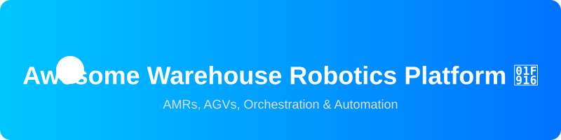

 

# Awesome-Warehouse-Robotics-Platform 🤖📦

## Top Warehouse Robotics Platform Tools Ecosystem 🚀
**Curated List of SaaS Products & Open-Source GitHub Projects**
*Focused on AMR/AGV Fleet Management, Warehouse Automation, Orchestration, AS/RS Integration & Multi-Robot Coordination*
**Last updated: August 2026**

This repository tracks notable **SaaS platforms** and **open-source projects** for **Warehouse Robotics**. These systems coordinate autonomous mobile robots (AMRs), automated guided vehicles (AGVs), goods-to-person systems, and related automation — handling task allocation, traffic management, integration with WMS/WES, and multi-fleet interoperability inside warehouses and fulfillment centers.

**Examples** include SVT Robotics, Formic, Locus Robotics, 6 River Systems, GreyOrange, Geek+, Fetch Robotics, Exotec, Vecna Robotics, InOrbit, AutoStore, Symbotic, Quicktron, Attabotics, and Swisslog SynQ (the category leaders and widely deployed platforms).

**Open-source emphasis**: Full commercial warehouse robotics suites remain largely proprietary, but a strong open-source layer exists for fleet coordination, navigation, and interoperability. This section prioritizes the most capable open frameworks that teams can use to build or extend multi-robot warehouse systems.

Contributions welcome! Open a PR to add/update entries. Keep descriptions factual and link to official sites / GitHub repos.

## Table of Contents
- [SaaS/Hosted Platforms](#saas-hosted-platforms)
- [Open-Source GitHub Projects](#open-source-github-projects)
- [How to Contribute](#how-to-contribute)
- [Disclaimer](#disclaimer)

## 🏭 SaaS/Hosted Platforms

| Platform | Description | Pricing | Free Tier / Trial Limit | Valuation/Size |
|----------|-------------|---------|-------------------------|----------------|
| **[Symbotic](https://www.symbotic.com/)** | AI-powered warehouse automation and robotics systems for high-volume distribution centers. | Starting from ~$20,000,000+ per facility | 0 Days trial, 0 Limit | $25B+ |
| **[AutoStore](https://www.autostoresystem.com/)** | Cube-based automated storage and retrieval system (AS/RS) with robots that work on top of the grid. | Starting from ~$500,000+ total system cost | 0 Days trial, 0 Limit | $4B+ |
| **[Exotec](https://www.exotec.com/)** | Skypod goods-to-person system and warehouse robotics platform focused on high-density storage and rapid picking. | Starting from ~$1,000,000+ system CapEx | 0 Days trial, 0 Limit | $2B+ |
| **[Locus Robotics](https://locusrobotics.com/)** | Leading AMR platform for person-to-goods fulfillment, known for collaborative robots and warehouse execution software. | Starting at ~$3,000/month per robot (RaaS) | 0 Days trial, 0 Limit | $2B+ |
| **[Geek+](https://www.geekplus.com/)** | Broad portfolio of warehouse robots (picking, sorting, moving) and intelligent warehouse management software. | Starting at $15,000 per individual robot unit | 0 Days trial, 0 Limit | $2B+ |
| **[Swisslog SynQ](https://www.swisslog.com/)** | Warehouse execution/robotics software and modular intralogistics platform. | Starting from ~$100,000+ per deployment | 0 Days trial, 0 Limit | $1B+ |
| **[GreyOrange](https://www.greyorange.com/)** | AI-driven fulfillment and warehouse robotics platform combining Ranger robots with GreyMatter orchestration software. | Starting at ~$3,500/month per robot | 0 Days trial, 0 Limit | $500M+ |
| **[Quicktron](https://www.quicktron.com/)** | Major player in AMR, 3D storage, and warehouse execution/robotics software. | Starting at $15,000 per individual robot | 0 Days trial, 0 Limit | $500M+ |
| **[6 River Systems](https://6river.com/)** (Shopify) | Collaborative mobile robot (Chuck) platform and warehouse orchestration software for fulfillment centers. | Starting at ~$2,500/month per robot (RaaS) | 30 Days Pilot Trial, Limit Negotiable | $450M+ |
| **[Fetch Robotics](https://fetchrobotics.com/)** (Zebra) | AMR platform for material transport and warehouse workflows, integrated into broader Zebra automation offerings. | Starting at ~$2,000/month per robot (RaaS) | 0 Days trial, 0 Limit | $300M+ |
| **[Attabotics](https://www.attabotics.com/)** | 3D robotic storage and retrieval system for e-commerce and retail. | Starting from ~$1,000,000+ system CapEx | 0 Days trial, 0 Limit | $300M+ |
| **[Vecna Robotics](https://www.vecnarobotics.com/)** | Autonomous mobile robots and orchestration software for warehouse and manufacturing material movement. | Starting at $10/hour per robot target (RaaS) | 0 Days trial, 0 Limit | $150M+ |
| **[Formic](https://www.formic.co/)** | Robotics-as-a-Service model that deploys and operates warehouse automation (including AMRs) with outcome-based pricing. | Starting at $4,750/month (Palletizer RaaS) | 90 Days Trial, 1 Palletizer System Limit | $100M+ |
| **[SVT Robotics](https://www.svtrobotics.com/)** | Softbot platform focused on rapid integration and orchestration of heterogeneous warehouse robots and automation equipment without heavy custom engineering. | Starting from ~$50,000+ per integration | 0 Days trial, 0 Limit | $100M+ |
| **[InOrbit](https://www.inorbit.ai/)** | Robot operations platform (cloud robotics) for monitoring, managing, and integrating robot fleets across vendors. | Free / Starting at ~$49/month for paid tiers | Forever Free, Unlimited Robots Limit | $50M+ |

## 💻 Open-Source GitHub Projects
- **[cartographer](https://github.com/cartographer-project/cartographer)**   
  Cartographer is a system that provides real-time simultaneous localization and mapping (SLAM) in 2D and 3D across multiple platforms and sensor configurations.
- **[navigation2](https://github.com/ros-navigation/navigation2)**   
  ROS 2 Navigation Framework and System
- **[rtabmap](https://github.com/introlab/rtabmap)**   
  RTAB-Map library and standalone application
- **[moveit2](https://github.com/ros-planning/moveit2)**   
  :robot: MoveIt for ROS 2
- **[rmf](https://github.com/open-rmf/rmf)**   
  Root repository for the RMF software
- **[grid_map](https://github.com/ethz-asl/grid_map)**   
  Universal grid map library for mobile robotic mapping

### Additional Strong Open-Source Options
- Traffic editor and building map tools within the Open-RMF ecosystem.
- Task allocation and auction-based planners.
- Elevator, door, and infrastructure adapters for full-facility integration.
- Monitoring dashboards and observability tools for robot fleets.
- Integration patterns between open fleet managers and open-source or commercial WMS/WES systems.

**Frameworks for building custom systems**: Most open warehouse robotics efforts combine **Nav2** (or equivalent navigation) on individual robots with **Open-RMF** or **openTCS** as the fleet coordination layer. VDA 5050 provides a standardized interface for mixing vendors. Full commercial platforms still dominate large-scale, high-reliability deployments, but the open stack is increasingly capable for research, mid-size facilities, and custom integrations.

## 🤝 How to Contribute
1. Fork the repo.
2. Add/edit entries in `README.md` (follow existing format).
3. Include: name, link, 1–2 sentence description, and whether it's SaaS or open-source.
4. Submit PR with a short explanation.

Star the repo if you find it useful!

## Disclaimer
- This is a **community-curated** list — not exhaustive and not an endorsement.
- Warehouse robotics platforms should be evaluated for robot performance, fleet scale, WMS/WES integration depth, traffic management robustness, safety certifications, vendor lock-in risk, and total cost of ownership (including RaaS models).
- Open-source fleet and navigation frameworks provide excellent interoperability and control but require significant robotics and systems engineering expertise to achieve production-grade reliability, safety, and throughput in live warehouse environments.
---
**Made for warehouse automation engineers, robotics integrators, logistics technologists, and teams building interoperable multi-robot systems.**
Let's make warehouse robotics more open, vendor-agnostic, and free from proprietary fleet lock-in.

##  Star History

